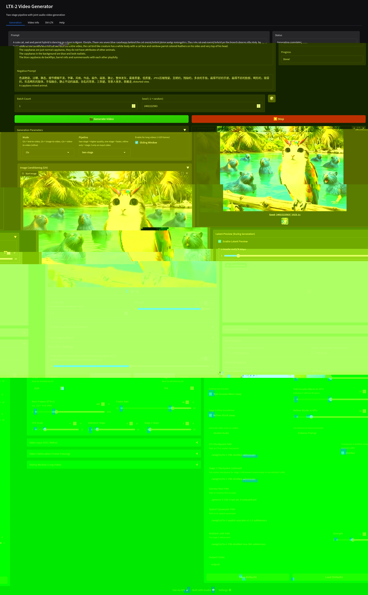

# to run the gui:
pip install uv
uv sync
uv run python lt1.py

Use with the official ltxv2 models and full gemma text encoder from the main ltx page. This repository is under active development and alot of features are quite broken but the basics should work well. If you need some helps to get it going I will try...  
  
# These are working settings to get a 609 frame video with a 24gb gpu
  
  
  
   
      
         
This repository is organized as a monorepo with three main packages:

* **[ltx-core](packages/ltx-core/)** - Core model implementation, inference stack, and utilities
* **[ltx-pipelines](packages/ltx-pipelines/)** - High-level pipeline implementations for text-to-video, image-to-video, and other generation modes
* **[ltx-trainer](packages/ltx-trainer/)** - Training and fine-tuning tools for LoRA, full fine-tuning, and IC-LoRA

Each package has its own README and documentation. See the [Documentation](#-documentation) section below.

## 📚 Documentation

Each package includes comprehensive documentation:

* **[LTX-Core README](packages/ltx-core/README.md)** - Core model implementation, inference stack, and utilities
* **[LTX-Pipelines README](packages/ltx-pipelines/README.md)** - High-level pipeline implementations and usage guides
* **[LTX-Trainer README](packages/ltx-trainer/README.md)** - Training and fine-tuning documentation with detailed guides
